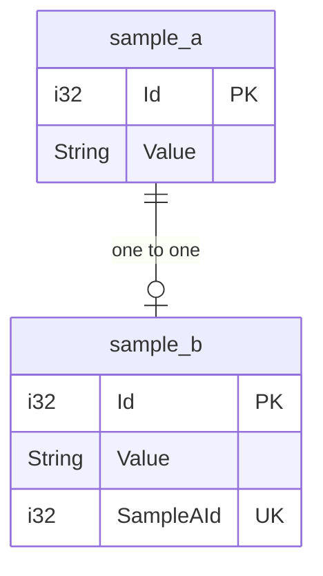
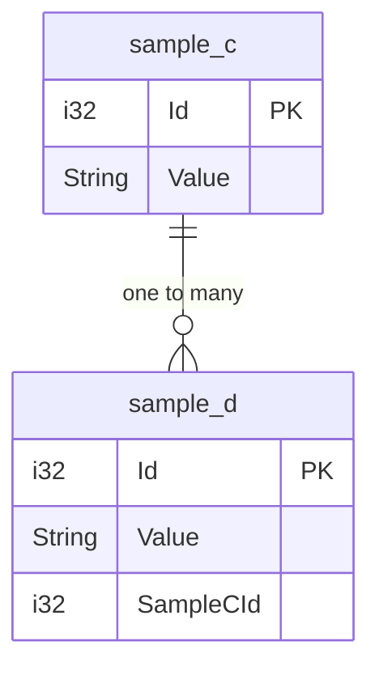
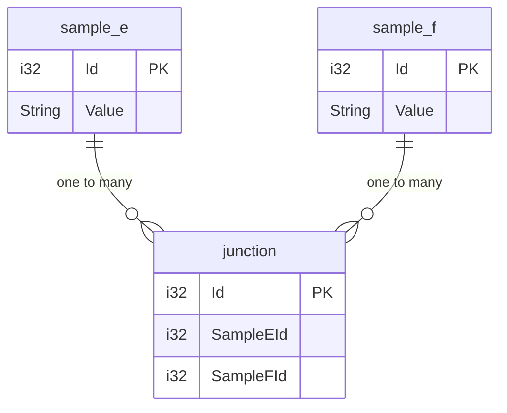

## One to One

sample_b は sample_a が存在しないと、生成できない関係

## One to Many

sample_d は sample_c が存在しないと、生成できない関係

## Many to Many

junction が中間テーブル

## 参考サイト

https://www.sea-ql.org/SeaORM/docs/relation/one-to-one/

https://www.sea-ql.org/SeaORM/docs/relation/one-to-many/

https://www.sea-ql.org/SeaORM/docs/relation/many-to-many/

https://www.sea-ql.org/SeaORM/docs/basic-crud/select/

https://zenn.dev/icy_mountain/scraps/dd0ff88411efdb
